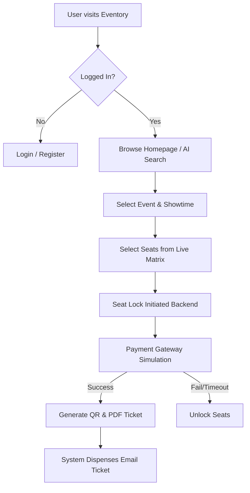
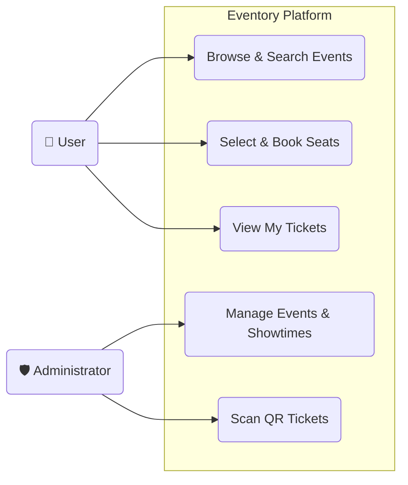
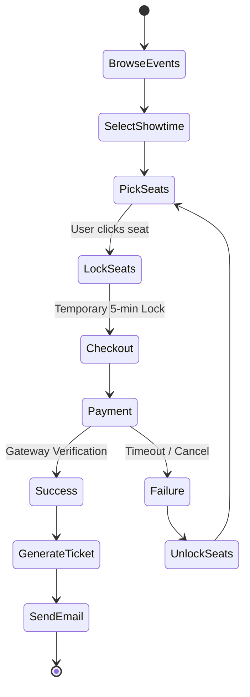
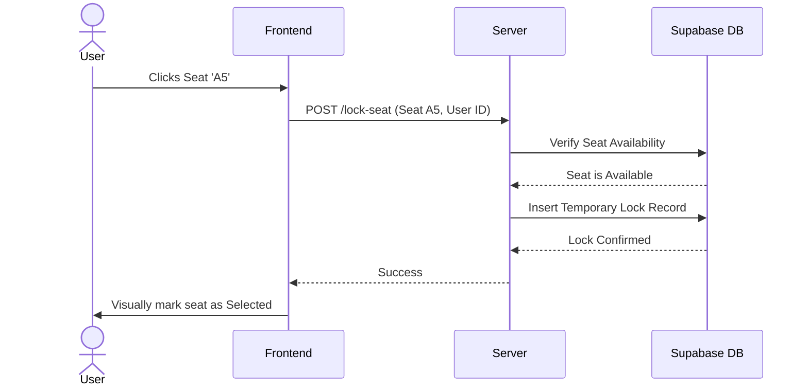
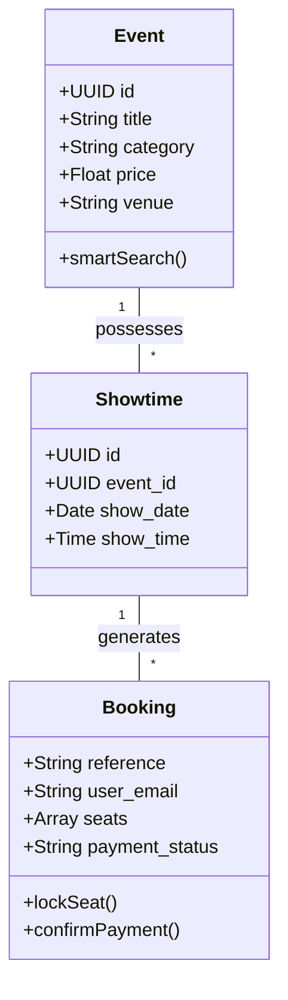
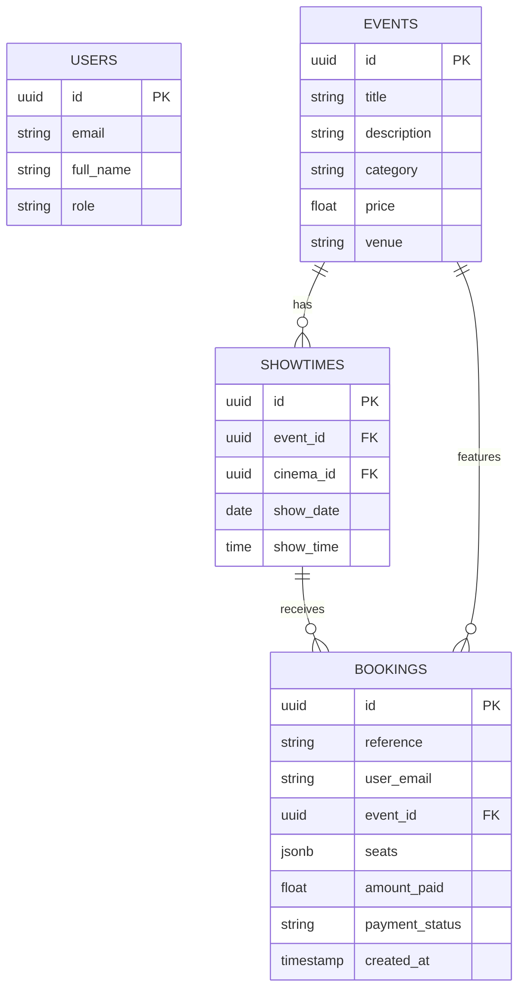

# Eventory: Comprehensive Project Report

## 1. Project Overview
**Eventory** is a modern, full-stack event and movie ticketing platform designed to offer a seamless, premium booking experience. It bridges the gap between organizers and attendees by providing a centralized hub for discovering, booking, and managing tickets for varied events—including movies, concerts, and sports. With an emphasis on aesthetic UI, advanced search logic, and real-time concurrency control, Eventory guarantees an intuitive purchasing journey.

---

## 2. Problem Statement
The contemporary ticketing industry faces several significant challenges:
1. **Seat Collision:** Dual checkout instances frequently result in double-booking of seats, leading to payment disputes.
2. **Fragmented Experiences:** Users must use different apps for movies vs. live concerts, resulting in disjointed ecosystems.
3. **Cluttered Interfaces:** Traditional platforms prioritize extreme density over user experience, overwhelming users.
4. **Poor Notification Systems:** Audiences often forget showtimes due to a lack of automated digital reminders.

Eventory solves these by providing a unified, aesthetically premium discovery platform equipped with live seat-locking algorithms, centralized PDF ticketing, and automated CRON-based reminders.

---

## 3. Requirement Analysis
**Functional Requirements:**
*   **User Module:** Browse events by category, geolocation sorting, smart keyword search, live seat selection, payment simulation, and view past bookings.
*   **Admin Module:** Event CRUD operations, manage showtimes across multiple cinemas, dynamic genre tagging, and QR code ticket scanning.
*   **System Module:** Live temporary seat locking (5-minute TTL), automated email ticketing (PDF + QR), backend 24-hour showtime email reminders.

**Non-Functional Requirements:**
*   Security: Secure session architecture and protected admin routes.
*   Performance: Fast API fetching and optimized SQL indexing using Supabase.
*   Usability: Dark/Light themed responsive user interface accessible across all mobile and desktop sizes.

---

## 4. UI, User Interaction, Theme, Platform
*   **Platform Details:** Developed entirely as a web application running on Node.js (Express backend) and Vanilla JS + Tailwind CSS (Frontend).
*   **Theme & Aesthetics:** Glassmorphism overlay principles, Deep Space Dark Mode, and smooth gradient highlights (Purple/Pink). Fully responsive to mobile visages.
*   **User Interaction:** Micro-animations on hover, toast notification alerts, interactive CSS grid-based seat matrix layout, and fluid carousel swiping.

---

## 5. System Specifications (SS) & Authentication
*   **Frontend Stack:** HTML5, Tailwind CSS, Vanilla JavaScript, local storage caching.
*   **Backend Stack:** Node.js, Express.js, node-cron (for automations).
*   **Database:** Supabase (PostgreSQL)
*   **Authentication Flow:** 
    *   Currently implemented using a session-based approach and LocalStorage simulation for user states. 
    *   Admins achieve entry via localized passcode validation (`auth.routes.js`), safeguarding sensitive endpoints.

---

## 6. System Flow Diagram (SFD)

---

## 7. UML Diagrams

### 7.1. Usecase Diagram

### 7.2. Activity Diagram (Booking Process)

### 7.3. Sequence Diagram (Concurrency Seat Locking)

### 7.4. Class Diagram (Data Entities)

---

## 8. ER Diagram (Entity Relationship)

---

## 9. Data Dictionary

### Table: `events`
| Column Name | Data Type | Description | Constraints |
| :--- | :--- | :--- | :--- |
| `id` | UUID | Unique identifier for event | Primary Key |
| `title` | VARCHAR | Name of the movie/concert | Not Null |
| `description` | TEXT | Details including Genres | Nullable |
| `category` | VARCHAR | Type (Movies, Concerts, etc.) | Not Null |
| `price` | INT | Base ticket price | Default 0 |
| `image_url` | VARCHAR | Cloud URL of the poster | Nullable |

### Table: `bookings`
| Column Name | Data Type | Description | Constraints |
| :--- | :--- | :--- | :--- |
| `id` | INT | Internal serial ID | Primary Key |
| `reference` | VARCHAR | Unique Ticket PNR Code | Unique |
| `event_id` | UUID | Relates to events table | Foreign Key |
| `user_email` | VARCHAR | Attendee mapping | Not Null |
| `seats` | JSONB / ARRAY | List of seated keys (e.g. `["A1"]`) | Not Null |
| `payment_status` | VARCHAR | `pending`, `locked`, `completed`| Enum |

---

## 10. Backend Work Overview
The backend is a highly structured MVC (Model-View-Controller) Express API.
*   **`/api/events`**: Utilizes an advanced "Smart Search" algorithm calculating heuristic match scores based on genres, keywords, and intents.
*   **`/api/bookings`**: Houses the live-seat-locking system using `created_at` timestamp constraints to prevent collisions.
*   **Automations (`reminder.service.js`)**: Runs a `node-cron` daemon matching upcoming shows to server time and automatically triggers Nodemailer payload deliveries indicating map directions.
*   **Services (`pdf.service.js` & `qr.service.js`)**: Natively manipulates PDF buffers dynamically generating visual ticket stubs complete with scannable QR verification matrices.

---

## 11. Testing
*   **Unit & Manual UI Testing:** Validated Mobile responsiveness mapping layout, verified horizontal flex-grid regressions on iOS/Android.
*   **Concurrency Testing:** Simulated simultaneous seat checkouts confirming that User B receives a "locked by someone else" alert if User A clicks within the 5-minute TTL.
*   **API Validation:** Endpoint response stress tested returning gracefully sorted JSON schemas for dynamic render ingestion.
